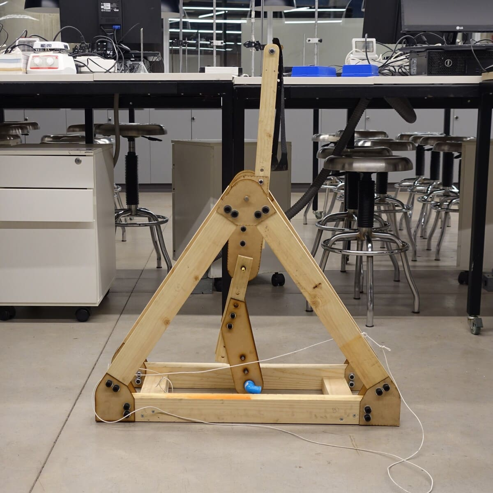

# Trebuchet UDD 
repositorio sobre la catapulta desarrollada para estudiantes udd

El desarrollo de este proyecto está inspirado en el trabajo de [Tom Stalton](https://www.youtube.com/@TomStantonEngineering).

>*Un **fundíbulo** (trebuchet) está formado por una viga o barra de madera sujeta a un armazón que la mantiene elevada del suelo. El punto de apoyo de la viga (usualmente un eje) está colocado en la parte superior del armazón. Del brazo corto de la barra se encuentra suspendido un contrapeso y del brazo largo una honda. La honda tiene un extremo atado a la viga y un extremo libre con un lazo donde se engancha la bolsa del proyectil.*
>[Wikipedia](https://es.wikipedia.org/wiki/Fundibulo)

---

### Herramientas
- Sierra ingletadora, serrucho, o similar
- Llave Allen 6mm
- Llave Allen 8mm
- 

### Materiales

|ID| Material | Detalle | Cantidad |
|:---|:---|---:|---:|
|**palo_60**| Pino 3x2" cepillado | 60cms| 4 |
|**palo_80**| Pino 3x2" cepillado | 80cms| 2 |
|**palo_22**| Pino 3x2" cepillado | 22cms| 2 |
|**palo_54**| Pino 2x1" cepillado | 54cms| 1 |
|**palo_12**| Pino 2x1" cepillado | 12cms| 1 |
|**palo_30**| Pino 2x1" cepillado | 30cms| 2 |
|**eje_40**| Barra acero 10mm | ~40cms | 1 |
|**sk_10**| Soporte aluminio | SK10 | 2 |
|**hilo_12**| Hilo 5/16 | 12cms | 3 |
|**tuer_516**| Tuerca hexagonal | 5/16" | 8 |
|**per_m8**| Perno Parker | M8 | 9 |
|**tuer_m8**| Tuerca hexagonal | M8 | 9 |
|**gol_m8**| Golilla plana | M8 | 18 |
|**per_m10**| Perno Parker | M10 | 24 |
|**tuer_m10**| Tuerca hexagonal | M10 | 24 |
|**gol_m10**| Golilla plana | M10 | 48 |

### Archivos

### Fabricación y ensamble

>documentado por [AndresMartinM](https://github.com/AndresMartinM) 2025