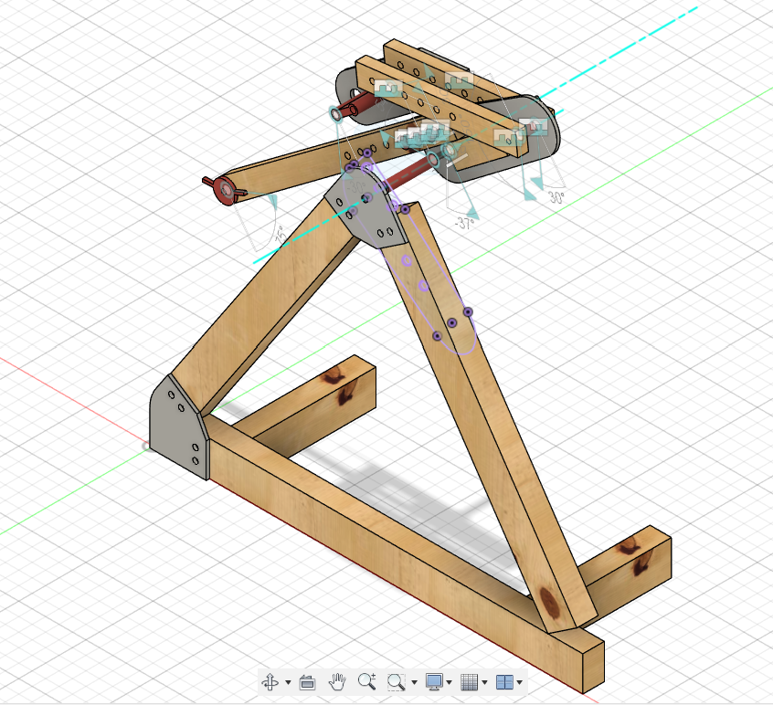

## Archivos de todas las piezas

- **F3D** archivo para fusion360 [trebuchetAbril2025-Comps-v14.f3d](trebuchetAbril2025-Comps-v14.f3d)
- **STEP** archivo de cad [trebuchetAbril2025-Comps-v14.step](trebuchetAbril2025-Comps-v14.step) 
- **STL** archivo 3d poligonal [trebuchetAbril2025-Comps-v14.stl](trebuchetAbril2025-Comps-v14.stl)

pantallazo de la catapulta en Autodesk Fusion 360:

archivos exportados desde:
*Fusion 2601.1.37 x86_64
Plano activo: Estudiante
Windows 11 Pro 24H2 (26100.4061)*

>documentado por [AndresMartinM](https://github.com/AndresMartinM) 2025